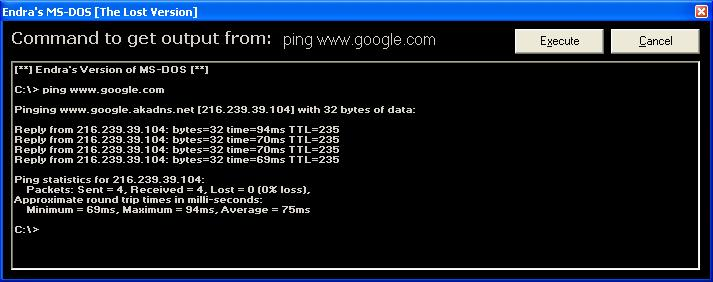



## ReadOutput v2\.1 \- New Look like DOS\!

### Description

Just like the previous versions except with a much better DOS like environment! For new users, this grabs output of CLI programs like PING, NETSTAT, etc. Some changes were made but none to the control!

'NEW IN V2.1:

'  -Nice more DOS like environment

'  -Replaced TextBox with Rich Text Format Box (More then 65535 chars allowed)

'  -Added support to the DOS 'CLS' command (Clear Screen)

'  -Replaced output of DOS 'CD' command to be C:\

'  -Made it show default path as C:\>

'  -Colors changed

'  -Added KeyPress event so you can press ENTER instead of clicking Execute
 
### More Info
 

             |
---                |---
**Submitted On**   |2004-05-22 14:54:58
**By**             |[AmineHaddad](https://github.com/Planet-Source-Code/PSCIndex/blob/master/ByAuthor/aminehaddad.md)
**Level**          |Advanced
**User Rating**    |4.3 (13 globes from 3 users)
**Compatibility**  |VB 5\.0, VB 6\.0
**Category**       |[Coding Standards](https://github.com/Planet-Source-Code/PSCIndex/blob/master/ByCategory/coding-standards__1-43.md)
**World**          |[Visual Basic](https://github.com/Planet-Source-Code/PSCIndex/blob/master/ByWorld/visual-basic.md)
**Archive File**   |[ReadOutput1748885222004\.zip](https://github.com/Planet-Source-Code/aminehaddad-readoutput-v2-1-new-look-like-dos__1-53949/archive/master.zip)

